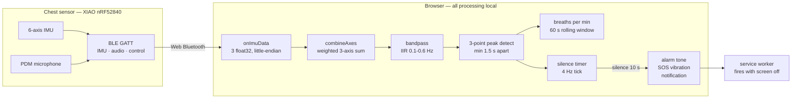

# BreathGuard

A browser-based monitoring dashboard for a low-cost wearable sleep apnea detector. Connects straight to a chest-worn sensor over **Web Bluetooth** — no app install, no server, no cloud. Filters the accelerometer stream in the browser, counts breaths, and raises an alarm when breathing stops for 10 seconds.

### **[▶ Open the live dashboard](https://pagarwalad.github.io/BreathGuard/)**

Chrome on Android or desktop — Web Bluetooth is required, so Safari and Firefox won't work. Without a paired device it loads in preview mode so you can see the interface.

> **Not a medical device.** Built for a university course and evaluated on a single volunteer performing deliberate breath-holds. It cannot diagnose anything. See [Limitations](#limitations).

---

## Context

Sleep apnea affects an estimated billion people, and most cases go undiagnosed because a clinical sleep study means a night in a lab wired to ~20 sensors at a cost of $1,000–$5,000. BreathGuard was built as a **~¥148 (≈US$20)** first-check: something you could wear at home to find out whether it's worth seeing a doctor.

The device targets **central sleep apnea**, where the brain stops signalling the chest to breathe and chest motion ceases entirely. That is what an accelerometer can see. Obstructive apnea — airway blocked while the chest keeps moving — is not detectable this way, which is the honest ceiling on the whole approach.

## What's in this repository

The system had three tiers. **This repo is the browser tier.**

| Tier | Role | Here? |
|---|---|---|
| Device — Seeed XIAO nRF52840 Sense | CircuitPython firmware; streams accelerometer + audio over BLE | ✗ teammate's |
| **Browser dashboard** | **Filters signal, counts breaths, detects apnea, alerts** | **✓ this repo** |
| Offline analyzer | Post-session Python diagnostics and accuracy scoring | ✗ not published |

```
index.html      # entire dashboard: UI, BLE client, signal processing, alerting
sw.js           # service worker — background alerts when the screen is off
manifest.json   # PWA metadata for home-screen install
```

Deliberately dependency-free and self-contained — one HTML file, no build step, no framework. That is why it can be served as a static page and still do real-time signal processing.

---

## How it works



**The filter.** Breathing sits at roughly 0.1–0.6 Hz (6–36 breaths/min). Everything outside that band is noise: gravity and postural drift below it, motion jitter above. A two-stage IIR bandpass runs on every sample, with coefficients recomputed per-sample from the measured interval — necessary because BLE notification timing is not uniform, so a fixed-rate filter would drift.

```js
const hp_a = 1.0 / (1.0 + 6.2832 * 0.1 * dt);   // high-pass: strips gravity + drift
const lp_a = 6.2832 * 0.6 * dt / (1.0 + 6.2832 * 0.6 * dt);  // low-pass: strips jitter
```

**Breath counting.** A sample counts as a breath if it's a local maximum across three points, exceeds a noise floor of 0.005, and arrives at least 1.5 s after the previous one (capping at ~40 breaths/min). The first 10 seconds of a session are discarded while the filter settles.

**Apnea detection.** A timer ticks at 4 Hz tracking time since the last peak. Past 10 seconds — the AASM scoring threshold for a respiratory event — it fires an alert and re-arms.

**Body position** is read directly from the gravity vector, so each event is tagged supine / prone / left / right. This matters clinically: some people only have apnea on their back.

### Staying alive overnight

The genuinely awkward part of a browser-based monitor is surviving a night with the screen off. Three browser APIs do the work:

- **Service worker** — holds the alarm path when the page is backgrounded, and fires the SOS vibration pattern
- **Screen Wake Lock** — stops Android from tearing down the Bluetooth connection, which it otherwise does within about 30 seconds of screen-off
- **Web App Manifest** — installs to the home screen and runs full-screen

---

## Results

From the course evaluation — three sessions, 20 minutes total, one volunteer performing deliberate breath-holds at logged times. A detection counted as correct if it fired within 5 s of the real event.

| | S1 · baseline | S2 · apnea test | S3 · posture | Total |
|---|---:|---:|---:|---:|
| Duration (min) | 5 | 10 | 5 | 20 |
| Breaths counted | 41 | 79 | 37 | 157 |
| Average BPM | 15.6 | 14.3 | 15.9 | 15.3 |
| True positives | — | 3 | 1 | 4 |
| False positives | 1 | 1 | 2 | 4 |
| Missed | — | 1 | 0 | 1 |
| **Detection rate** | — | 75% | 100% | **80%** |
| **False alarms/hr** | 12 | 6 | 24 | **12** |

Against the targets set at the start: **80% detection — met** (target ≥80%). **12 false alarms/hour — missed badly** (target ≤5). Nearly all of the false alarms came from S3, where rolling between positions repeatedly tripped the detector. The single missed event was the shortest breath-hold, 15 s, and it coincided with a position change that reset the silence timer.

> These figures were measured against the project's final Python receiver, which added gravity subtraction and signal-level gating. **The dashboard in this repo implements the earlier fixed-weight axis combination** (see below), so it is not the exact configuration those numbers describe.

## Known gap between this code and the final design

The project went through three iterations. The dashboard here corresponds to **v2**:

| | v1 | v2 — *this dashboard* | v3 — final |
|---|---|---|---|
| Sample rate | 0.7 Hz | 2.3 Hz | 8 Hz |
| Axis handling | single axis | fixed weights `1.0·az + 0.3·ay + 0.3·ax` | subtract gravity, take 3-axis magnitude |
| False-alarm gate | none | none | signal RMS must sit between 0.005 and 0.50 |
| Result | signal unusable | works supine, fails on side | position-independent |

Porting v3's gravity subtraction and RMS gate into `index.html` is the obvious next change — the algorithm is fully specified in the project report. It is left as-is here rather than reimplemented untested against hardware that is no longer assembled.

---

## Hardware

| Component | Cost | Role |
|---|---:|---|
| Seeed XIAO nRF52840 Sense | ¥110 | 6-axis IMU + PDM mic + BLE, thumb-drive sized |
| LiPo battery 250 mAh | ¥30 | Power |
| 3D-printed clip | ¥5 | Sternum mount |
| Wiring | ¥3 | — |
| **Total** | **¥148** | ≈ US$20 |

Firmware was written in CircuitPython rather than C — a deliberate trade of runtime efficiency for iteration speed on a project measured in weeks.

## Running it

Any static host works. Locally:

```bash
git clone https://github.com/pagarwalad/BreathGuard.git
cd BreathGuard
python3 -m http.server 8000
```

Then open `http://localhost:8000` in Chrome. Web Bluetooth requires a secure context — `localhost` counts, as does HTTPS; a plain `file://` open will not.

## Limitations

- **One subject, 20 minutes.** All events were voluntary breath-holds. Real apnea is involuntary, happens over 8 hours, and looks different.
- **Never tested overnight.** Longest session was 10 minutes. Whether the BLE connection and wake lock survive a full night is unknown.
- **Central apnea only.** Obstructive apnea leaves chest motion intact and is invisible to this method. A ~$3 MAX30102 pulse-oximeter would cover it.
- **Silent failure mode.** If Bluetooth drops, monitoring stops without warning. Detection would need to move onto the device to fix that.
- **Thresholds tuned to one body.** The noise floor and peak spacing were fitted to a single person's chest movement.
- **False alarm rate is 2.4× the target**, concentrated around position changes.

## Credits

HKUST **COMP4531** (IoT & Smart Sensing), Group 29.

| | |
|---|---|
| **Namann Deepak Jain** | CircuitPython firmware, BLE GATT services, hardware assembly, IMU driver |
| **Kavya Pareek** | Python signal-processing receiver, gravity subtraction, apnea detection logic, test sessions |
| **Pranav Agarwal** | Browser dashboard (this repo), offline analysis script, validation script, report |

Threshold of 10 s follows the AASM Scoring Manual v2.6. Prevalence figures from Benjafield et al., *Lancet Respiratory Medicine* 7(8), 2019.
